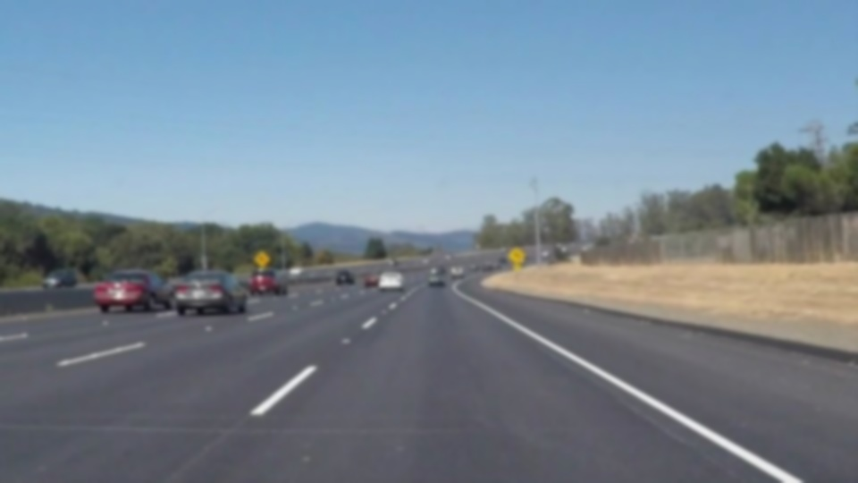
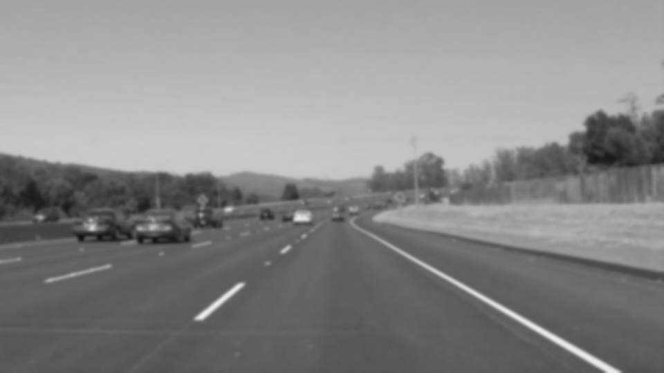
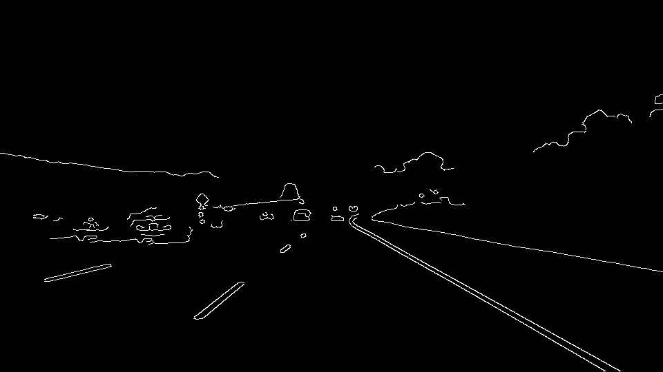
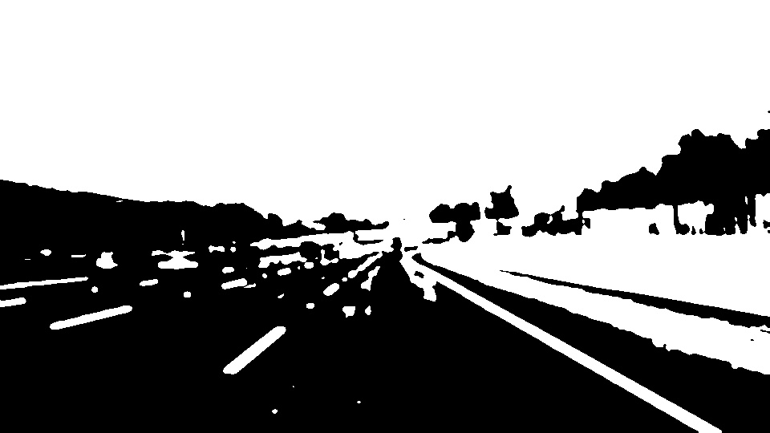
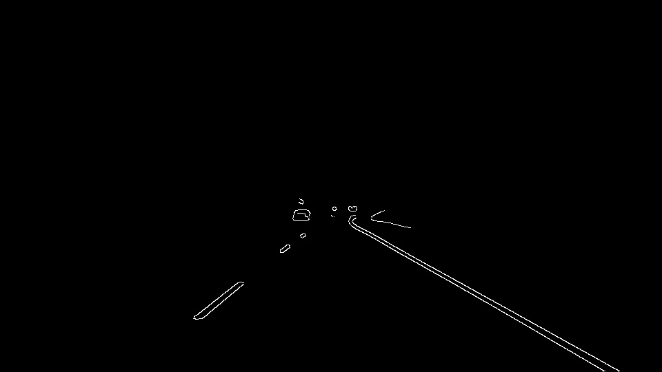
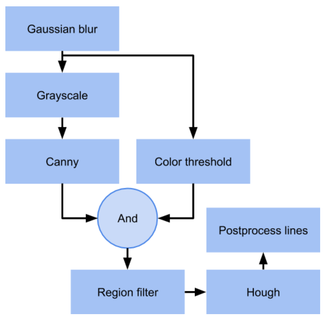

# **Finding Lane Lines on the Road** 

## 

### Reflection

### 1. Describe your pipeline. As part of the description, explain how you modified the draw_lines() function.

My pipeline is consist in the following steps:

- Gaussian blur: Applying gaussian blur remove high frequencies and smooth threshold and gradient steps.

  

- Grayscale: In other to apply canny we have to convert the image in grayscale. I does not test another color spaces like HSV or Lab that could be interesting in order to detect acromatic colors.

  

- Canny: Allow to find edges of the image, is the first step to aproximate the lanes of the road.

  

- Color thresholding: In order to focus the next steps in lanes, we can threshold the "white lines".

  

- Region filter: This step remove all the detections outside a region of interest. This region is the unique posible region that the lanes will appear.

  

- Hough Estimator: Hough transform aproximate the most relevant segments that's appear in the image.

  

- Postprocess: Hough estimator is a little bit tricky, normally the edge detector generate trash that is detected in hough... In order to remove that we threshold the posible angles of this lanes. Left: -55, -25, Right: 25, 55.
  

### 2. Identify potential shortcomings with your current pipeline

There are a lot... Classical computer vision it's fully dependent of the thresholding that you are appling.

- Different illumination.
- Sun reflectance.
- Shadows.
- Lane in diferent colors: yellow, red, blue, green...
- Highly curve lane is not detected by hough. Frenet curve?
- Too much noisy sensor.
- Lane very wide could have outside the region filter.

### 3. Suggest possible improvements to your pipeline

Increase the number of test samples, try in different scenarios and cars.

Use mathematical morphology to improve the current pipeline.